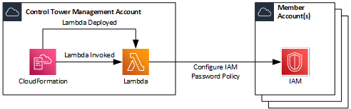

# IAM Password Policy

The CloudFormation Template and Lambda Function have been created to configure an IAM Password Policy. When leveraging this script with AWS Control Tower, it can be applied against multiple Accounts by modifying the configuration within the Customisations for Control Tower `manifest.yaml`.


## Architecture Overview



## Pre-Requisites

1.  The CloudFormation Template `iam-password-policy.yaml` should be added to the `/templates` folder for use with Customisations for Control Tower.
2.  The CloudFormation Parameters File `iam-password-policy.json` should be added to `/parameters` folder for use with Customisations for Control Tower.
3.  The CloudFormation Template requires the following parameters:
    * **MaxPasswordAge:** This is the maximum length of time that a password can be used prior to requiring to be changed. CIS Benchmarks requires this to be configured to 90 days.
    * **MinPasswordLength:** This is the minimum length of characters that the password must be. CIS Benchmarks requires this to be configured to 14 characters.
    * **PasswordHistory:** This is the number of previous passwords that are remembered to prevent re-use. CIS Benchmarks requires this to be configured to 24 previous passwords.
    * **RequireUppercaseChars:** This is to force the password complexity to require at least 1 Uppercase Character. CIS Benchmarks requires this to be True.
    * **RequireLowercaseChars:** This is to force the password complexity to require at least 1 Lowercase Character. CIS Benchmarks requires this to be True.
    * **RequireNumbers:** This is to force the password complexity to require at least 1 Numeric Character. CIS Benchmarks requires this to be True.
    * **RequireSymbols:** This is to force the password complexity to require at least 1 Symbol Character. CIS Benchmarks requires this to be True.

    The above values should be configured within the `iam-password-policy.json`:

    ```json
    [
        {
            "ParameterKey": "MaxPasswordAge",
            "ParameterValue": "90"
        },
        {
            "ParameterKey": "MinPasswordLength",
            "ParameterValue": "14"
        },
        {
            "ParameterKey": "PasswordHistory",
            "ParameterValue": "24"
        },
        {
            "ParameterKey": "RequireUppercaseChars",
            "ParameterValue": "True"
        },
        {
            "ParameterKey": "RequireLowercaseChars",
            "ParameterValue": "True"
        },
        {
            "ParameterKey": "RequireNumbers",
            "ParameterValue": "True"
        },
        {
            "ParameterKey": "RequireSymbols",
            "ParameterValue": "True"
        }
    ]
    ```

4.  Update the `manifest.yaml` and configure the `deployment_targets` accordingly based on your needs. The extract below shows it being applied to a specific AWS Account (e.g. Control Tower Management Account) as well as the Root OU and therefore applying it to all AWS Accounts within the AWS Organisation.

    ```yaml 
    - name: Configure-IAM-Password-Policy
      description: "CloudFormation Template to Configure an IAM Password Policy by default"
      resource_file: templates/iam-password-policy.yaml
      parameter_file: parameters/iam-password-policy.json
      deploy_method: stack_set
      deployment_targets:
        accounts:
            - CT Management
        organizational_units:
            - Root
      regions:
        - eu-west-2
    ```